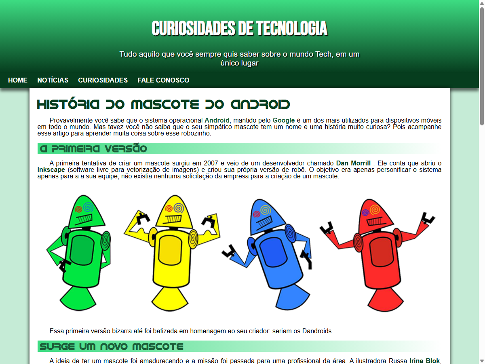
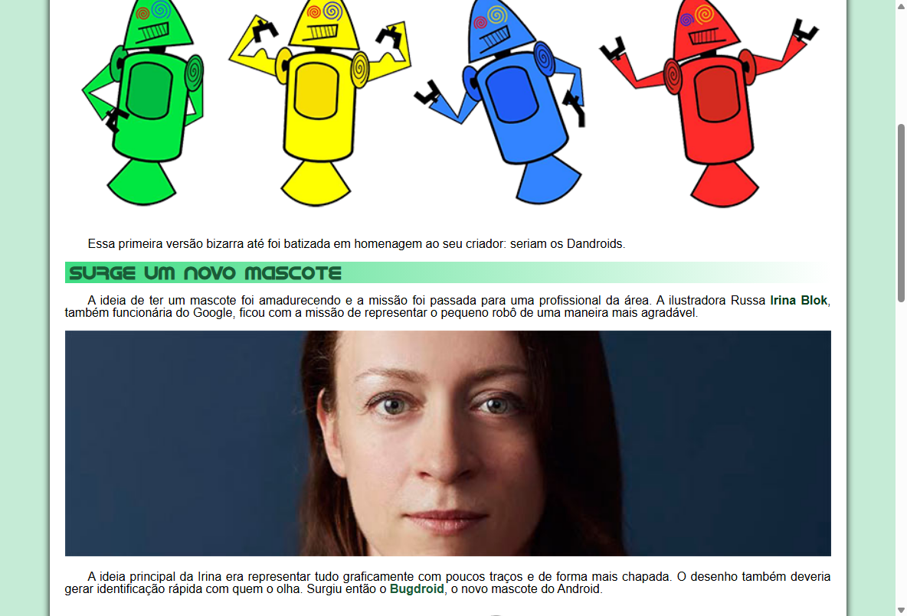
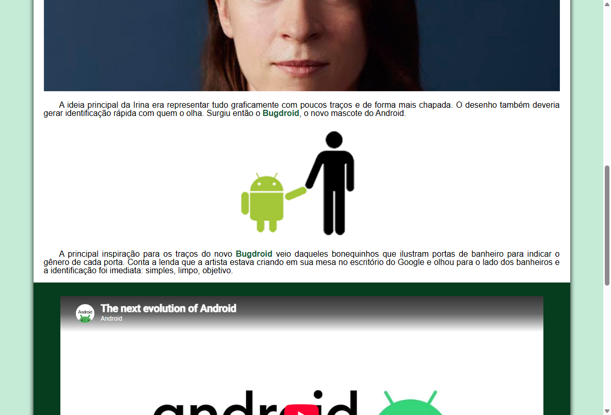

# Curiosidades de Tecnologia — A História do Mascote do Android

Site em formato de artigo/blog contando a história do **Bugdroid**, o mascote do Android — do primeiro rascunho de 2007 até a versão criada pela ilustradora Irina Blok. Feito em **HTML e CSS**, com layout responsivo via media queries.

🔗 **Demo:** [erickkadr.github.io/SiteAndroid](https://erickkadr.github.io/SiteAndroid/)

## Prints

| Abertura do artigo | Os primeiros "Dandroids" |
|---|---|
|  |  |

<details>
<summary>Ver mais um print (o Bugdroid atual)</summary>



</details>

## Sobre o projeto

Uma página de conteúdo (artigo) sobre a origem do robozinho verde do Android — desde a primeira tentativa não-oficial de um desenvolvedor do Google em 2007 (os "Dandroids"), até a criação da versão que conhecemos hoje.

## Motivação

Exercício de treino para praticar **HTML semântico para conteúdo de texto longo** (títulos, parágrafos, listas, imagens, vídeo incorporado) e **CSS responsivo com media queries**, adaptando o layout de artigo para diferentes tamanhos de tela.

## Funcionalidades

- Layout de artigo com cabeçalho, navegação e conteúdo estruturado
- Imagens ilustrando cada fase da evolução do mascote
- Vídeo incorporado sobre o tema
- Totalmente responsivo (media queries para desktop, tablet e mobile)

## Tecnologias

- **HTML5** (conteúdo, listas, mídia incorporada)
- **CSS3** (media queries para responsividade)

## Como rodar localmente

Sem build, sem dependência — abra `index.html` no navegador ou sirva a pasta:

```bash
npx serve .
```

---

### Made with ♥ by Erick Alexandre Dantas Ribeiro | [Contato](https://www.linkedin.com/in/erick-a-d-r-4033a5247/)
